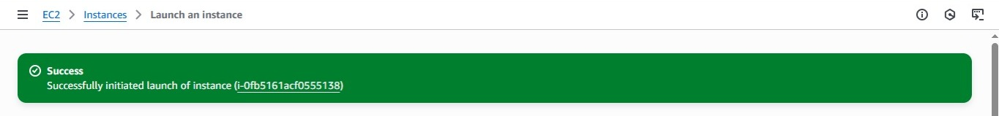
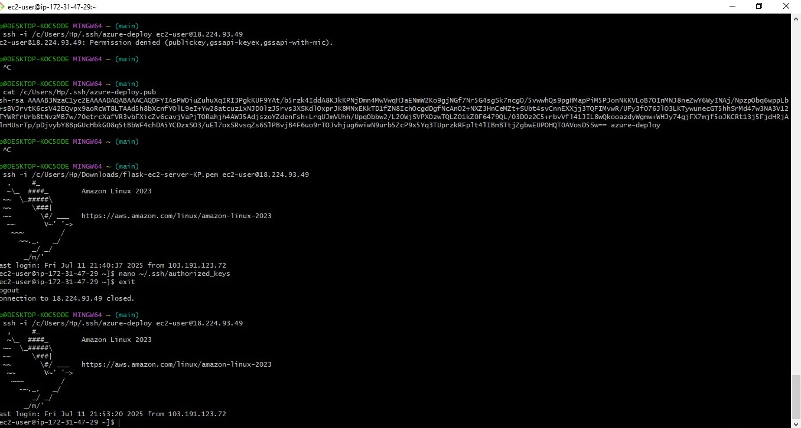
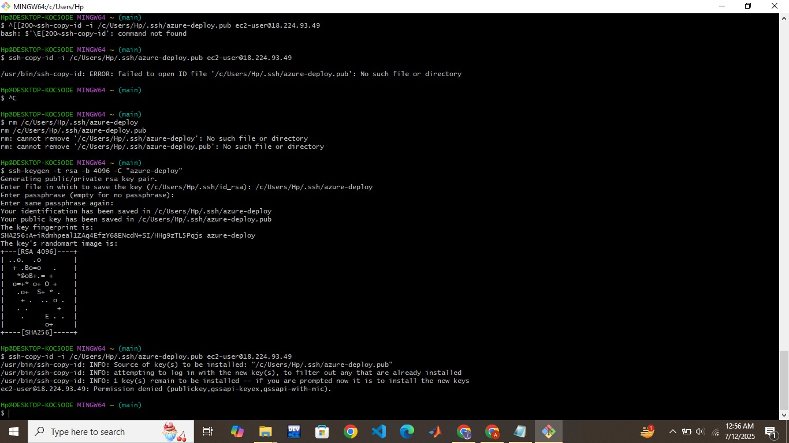
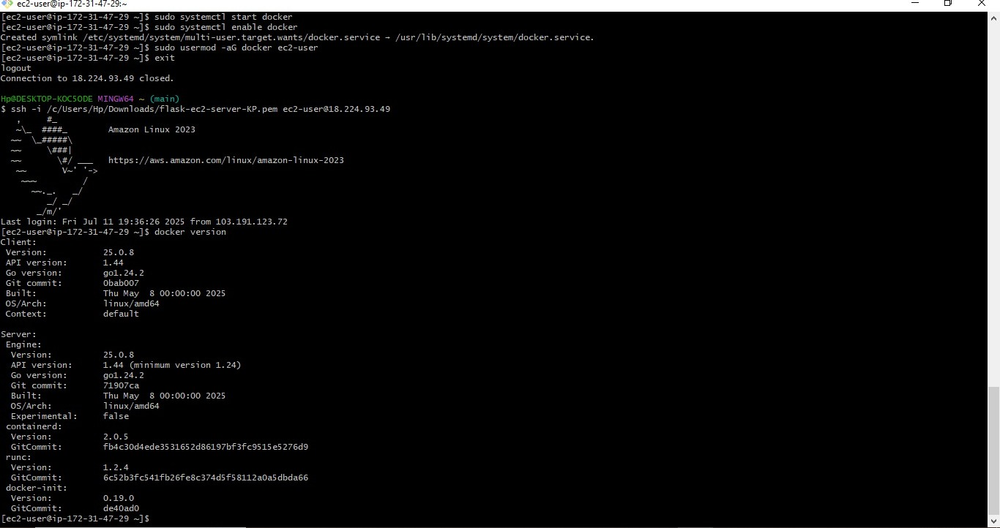
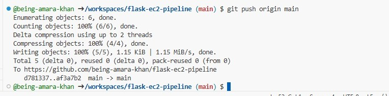
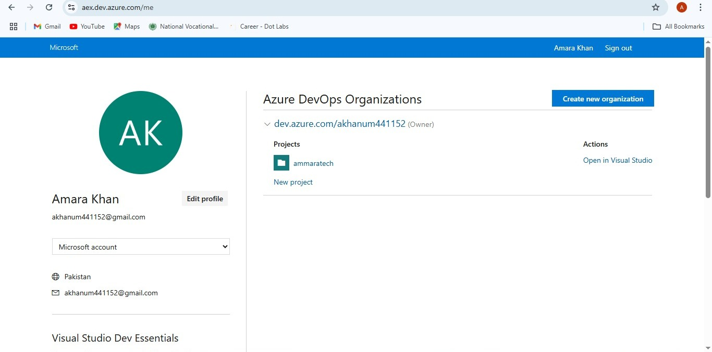
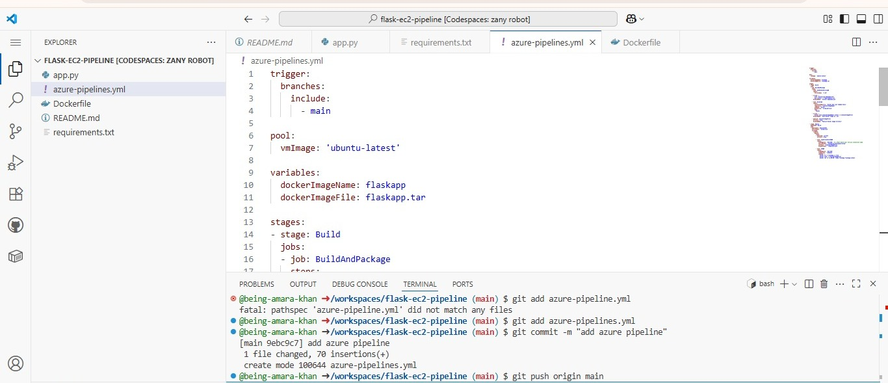
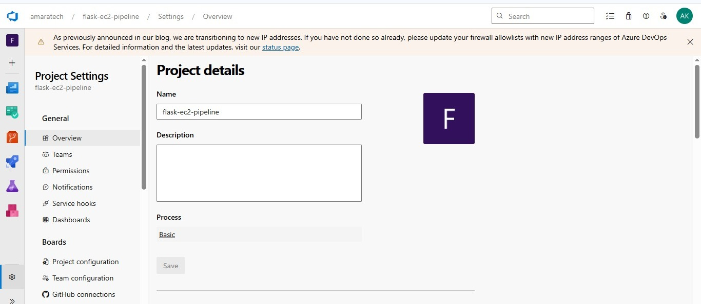
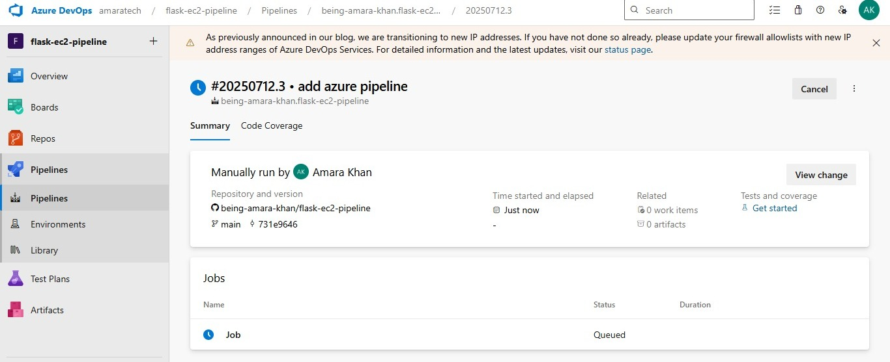
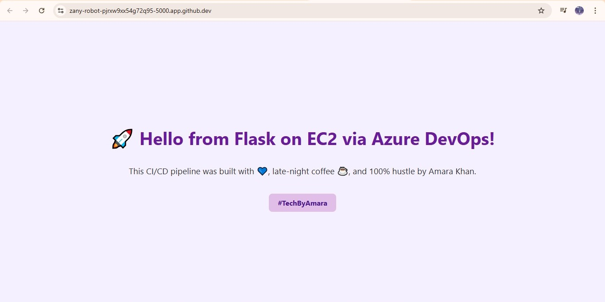

# 🚀 Flask App CI/CD Pipeline with Azure DevOps & AWS EC2

This project demonstrates how to build a **CI/CD pipeline using Azure DevOps** that deploys a Flask application from GitHub to an **AWS EC2 instance** using **Docker**. It includes SSH key setup, service connection in Azure DevOps, pipeline YAML, and automatic deployment.

✅ **Live app is directly accessible on the EC2 public IP (port 80).**

---

## 🧠 Project Overview

* 🐍 Developed a simple Flask app.
* 🐳 Containerized the app with Docker.
* 📦 Pushed code to **GitHub**.
* 🔑 Setup secure **SSH access** to EC2.
* 📘 Created an **Azure DevOps** project.
* 🔁 Wrote a **CI/CD pipeline** in `azure-pipelines.yml`.
* ⚙️ Deployed the Docker container from Azure DevOps to EC2.

---

## 📁 Folder Structure

```
📦 flask-ec2-pipeline/
 ┣ 📄 app.py
 ┣ 📄 requirements.txt
 ┣ 📄 Dockerfile
 ┣ 📄 azure-pipelines.yml
 ┗ 📄 README.md
```

---

## 🌐 Live URL

> Your Flask app is accessible directly on your EC2 instance's public IP:

```
http://<ec2-public-ip>
```

---

## 📝 Step-by-Step Setup

---

### ✅ STEP 1: Launch EC2 Instance

* Go to AWS Console and **create a new EC2 instance** using Amazon Linux 2023.
* Open ports **22** and **80** in your **Security Group**.




---

### ⚙️ STEP 2: Install Docker on EC2

SSH into your EC2 instance and run:

```bash
sudo yum update -y
sudo yum install docker -y
sudo systemctl start docker
sudo systemctl enable docker
sudo usermod -aG docker ec2-user
```



---

### 🔐 STEP 3: Manual SSH Key Setup (for Azure DevOps)

This step allows **Azure DevOps** to SSH into EC2.

* Generate a new SSH key:

```bash
ssh-keygen -t rsa -b 4096 -C "azure-deploy"
```

* Add the **public key** (`.pub`) into EC2’s `~/.ssh/authorized_keys`.

#### 🔐 Manual SSH Key Setup (Failed Attempt)  


#### ✅ Manual SSH Key Setup (Success)  


---

### 🛠️ STEP 4: Flask App & Codespace Setup

* Created a **Flask app** with message:

  > `"Hello from Flask on EC2 via Azure DevOps!"`
* Pushed the complete code to GitHub from **GitHub Codespaces**.
#### 💻 Flask App Running on GitHub Codespace  


---

### 🧪 STEP 5: Create Azure DevOps Organization & Project

* Go to: [Azure DevOps Portal](https://dev.azure.com/)
* Sign in and create a **new organization** and **project**.
#### 🏗️ Azure DevOps Org Setup  



---

### 🔧 STEP 6: Commit Azure Pipeline File

Created a file called `azure-pipelines.yml` in root of repo.
#### 📝 Azure Pipeline File Commit  


### 📌 STEP 7: Create Azure Pipeline

* Go to Azure DevOps → Pipelines → Create pipeline.
* Connect GitHub repo.
* Choose existing YAML file (`azure-pipelines.yml`).

#### 🔧 Azure Pipeline Creation  


---

### 🔐 STEP 8: Add SSH Service Connection

* Go to **Project Settings** → **Service Connections**
* Add a new **SSH connection** with:

  * Host: your EC2 IP
  * Username: `ec2-user`
  * Upload your **private key** (`.pem` or SSH key)
  * Name it `EC2-SSH`

#### 🔐 Azure DevOps SSH Service Connection  

---

### 🧪 STEP 9: Trigger the Pipeline

Once all is set up, the pipeline will:

1. Build Docker image.
2. Save `.tar` of image.
3. Push to EC2 via SSH.
4. Load Docker image on EC2 and run the container on port 80.

#### 🚀 Azure DevOps Pipeline Run Dashboard  


---

### 🚀 Final Output

* Your Flask app is now running live from **EC2** on **port 80**.
* Can be accessed via EC2’s public IP.
#### ✅ App Deployed on EC2  

---

## 💡 Key Highlights

* 💻 CI/CD Pipeline with Azure DevOps and GitHub.
* 🐳 Dockerized Flask app for portability.
* 🔐 SSH setup enables secure deployment.
* 🚀 Fully automated build and deploy on every commit to `main`.

---

## 🧠 Credits & Author

> This CI/CD pipeline was built with late-night coffee ☕, and 100% hustle 💪 by **Amara Khan**
> \#TechByAmara


